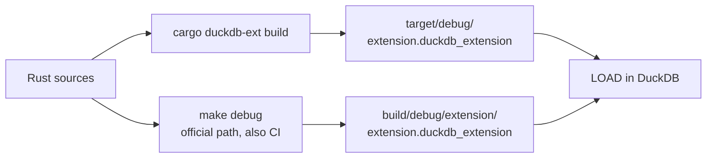
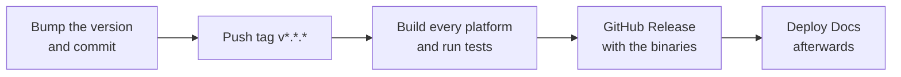

# Build and release

## Two build paths

Both are kept in sync; use whichever is faster for what you are doing.

```shell
cargo duckdb-ext build   # fast loop, no make
# -> target/debug/my_extension.duckdb_extension

make configure           # once: builds configure/venv (Python + the sqllogictest runner)
make debug               # the official template path, also what CI runs
# -> build/debug/extension/my_extension/my_extension.duckdb_extension
```

The two paths and where each one puts the artifact:



`make release` is the optimized version of the same flow. On Windows `make` has to run inside Git
Bash.

## Justfile

| Command | What it does |
| --- | --- |
| `just build` | `cargo duckdb-ext build` |
| `just sql "SELECT my_greet('world')"` | Build, then run one statement and exit |
| `just repl` | A DuckDB REPL with the extension loaded |
| `just lint` | `cargo clippy --all-targets -- -D warnings` |
| `just test` | The official build and the sqllogictest run |
| `just docs_csv` | Export the function descriptions to `target/function_descriptions.csv` |
| `just docs_build` / `just docs_start` | Build / serve this documentation site |
| `just rename <name>` | Rewrite the extension name everywhere |
| `just release_*` | The release flow below |
| `just sync-common` / `just check-common` | Update / verify `scripts/common.just` (below) |

Every recipe here lives in `scripts/common.just` — a file shared by every extension project and imported
by the root `Justfile` (`just --list` shows the merged set). Its source of truth is the duckfn
repository: `just sync-common` pulls the latest copy, `just check-common` reports when this one differs.
Put project-specific commands in the root `Justfile` rather than editing the copy; see `AGENTS.md`.

## Release flow

A release is four steps, and only the second one is manual:

| Step | Command |
| --- | --- |
| 0. Pre-flight | `just release_check` (clippy + build); `just test` when the change warrants it |
| 1. Bump the version | `just release_bump {{EXTENSION_VERSION}}` |
| 2. Commit and tag | `git commit …` then `just release_tag {{EXTENSION_VERSION}}` |
| 3. Watch CI | `just release_ci`, then `gh run watch <run-id>` |
| 4. Next development version | `just release_dev 0.1.1-dev.0` |

The version lives in `Cargo.toml` (`[package] version`) and nowhere else:
`scripts/release.sh bump` rewrites that one line, updates the occurrences in the docs and the CI
comments, syncs `Cargo.lock` and fixes `docs/extension-version.ts`, which is where the documentation
site gets the version number it prints. The tag has to match `Cargo.toml`, because cargo writes the
version into the built extension — a mismatch would publish a release claiming another version.

Only real releases get a tag. A version like `0.1.1-dev.0` stays on the branch: no tag, no release, no
site deployment.

### What a tag triggers

Pushing `v*.*.*` starts **Main Extension Distribution Pipeline**:



- **Main Extension Distribution Pipeline** — builds the extension for every supported platform, runs the
  tests, then creates (or updates) a GitHub Release for that tag with the built binaries attached as
  `<extension>-<arch>.duckdb_extension` (the wasm ones as `.duckdb_extension.wasm`). Release notes are
  the commits since the previous version tag.
- **Deploy Docs** is not started by the tag but by that pipeline *finishing*: it builds `docs/` and
  publishes it to GitHub Pages (it waits for the release, which the deployed site then preloads). It
  needs the one-time *Settings → Pages → Source: GitHub Actions* setting.

Pull requests run the build and the tests only; publishing is gated on the ref being a version tag.

### Installing a release

```sql
LOAD 'https://github.com/<owner>/<repo>/releases/latest/download/my_extension-windows_amd64.duckdb_extension';
```

A locally built extension needs `duckdb -unsigned`; a released one that a user downloads also has to be
loaded with that flag, because it is not signed by DuckDB's distribution key. That is what the
[community-extension](./community-extension.md) route fixes: once registered, `INSTALL … FROM community`
fetches a signed build for the user's platform.

## WebAssembly

```shell
just config_env   # once: pin the toolchain and add the wasm32-unknown-emscripten target
just build_wasm
```

The wasm build goes through `src/wasm_lib.rs`, a `staticlib` mirror of `src/lib.rs`. The two crate roots
must always declare the same set of `mod`s, and platform-specific dependencies belong under
`[target.'cfg(…'.dependencies]` in `Cargo.toml` so the wasm target does not pay for them (some crates
do not compile for emscripten at all).

Under `wasm32-unknown-emscripten` a `cdylib` has to be linked as a **side module**: cargo also builds
the `cdylib` of the duckfn dependency, and without `-sSIDE_MODULE=2` emcc links it as a standalone
module and fails with `undefined symbol: main`. That flag belongs to
`.cargo/config.toml` (`[target.wasm32-unknown-emscripten] rustflags`) — keep it there, it is what makes
`just build_wasm` / `just build_wasm_eh` work.
