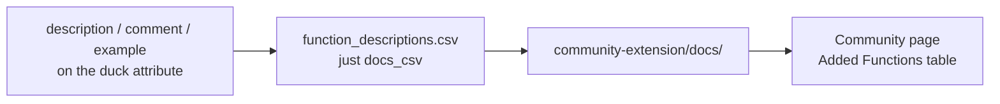

# Community extensions

Registering the extension in [duckdb/community-extensions](https://github.com/duckdb/community-extensions)
is what turns "download a file from a GitHub Release" into:

```sql
INSTALL my_extension FROM community;   -- once, needs network
LOAD my_extension;
```

The community build is signed and matches the user's DuckDB version, so `-unsigned` is no longer
needed. The registration itself is a pull request that adds **two files**:

| In this repository | In the community repository |
| --- | --- |
| `community-extension/description.yml` | `extensions/my_extension/description.yml` |
| `community-extension/docs/function_descriptions.csv` | `extensions/my_extension/docs/function_descriptions.csv` |

The directory name must equal `extension.name` exactly — the community repository's `scripts/build.py`
checks it.

## The CSV

The `Added Functions` table on the community extension page gets a function's description, comment and
example from this CSV and nowhere else: DuckDB's C extension API has no way to set them. The text comes
from the `description` / `comment` / `example` arguments of the `#[duck_*]` attributes, so it lives next
to the function it describes:

```rust
#[duck_scalar_function(
    description = "Greets someone by name, the simplest possible scalar function",
    comment = "…",
    example = "SELECT my_greet('world')"
)]
```

Regenerate and copy it whenever those attributes change:

```shell
just docs_csv
cp target/function_descriptions.csv community-extension/docs/function_descriptions.csv
```

From the attribute to the page:



Several examples are joined with `"; "` on export and lose their trailing semicolons; newlines collapse
into spaces, because the target is a Markdown table. Write one complete statement per entry, in English.

## `description.yml`

The file is copied to the community repository as it is, so it holds fields and no comments. The fields
that need a decision:

| Field | What to put there |
| --- | --- |
| `extension.name` | The extension name, identical to the directory name and to the entry-point symbol. |
| `extension.description` | One line, shown in the extension list. |
| `extension.version` | The released version, without a `-dev.N` suffix. |
| `extension.language` / `build` | `Rust` and `cargo` for a project built from this template. |
| `extension.license` | `MIT` (the repository's `LICENSE`). Note the community *docs page* spells it `licence`; the real schema is `license`. |
| `extension.requires_toolchains` | `"rust;python3"` — the same value the CI workflow passes as `extra_toolchains`. |
| `extension.maintainers` | Your GitHub handle. |
| `repo.github` | `owner/repository`. |
| `repo.ref` | The **commit SHA** (40 characters) of the released version — `git rev-list -n 1 v0.1.0` — not `main` and not the tag name. A registration points at immutable code, and a build from a branch would claim a development version. |
| `docs.hello_world` | A runnable example, rendered into a code block. Do not write `INSTALL` / `LOAD` here: the page adds those itself. |
| `docs.extended_description` | The prose around the function table. |

`community-extension/AGENTS.md` explains each field's provenance and the submission steps in more
detail.

## Submitting

```shell
# 1. in a clone of your fork of duckdb/community-extensions
git checkout -b add-my-extension

# 2. copy the two files into place
mkdir -p extensions/my_extension/docs
cp <this repo>/community-extension/description.yml extensions/my_extension/
cp <this repo>/community-extension/docs/function_descriptions.csv extensions/my_extension/docs/

# 3. commit, push, open the PR
git add extensions/my_extension
git commit -m "Add my_extension: …"
gh pr create --repo duckdb/community-extensions --base main --head <you>:add-my-extension
```

The maintainers will run the build workflows (a first-time contributor's run shows up as
`action_required` until someone approves it — that is normal). After the merge, `INSTALL my_extension
FROM community` works, and the README can point at it.

## Keeping it in step

`repo.ref` and `extension.version` are pinned to one release. After every release, update both in this
repository's `community-extension/`, copy them into the community repository, and push to the same PR
branch (or open a new one). `just release_bump` already rewrites the `version` field; the commit SHA is
the part a human has to fill in.
