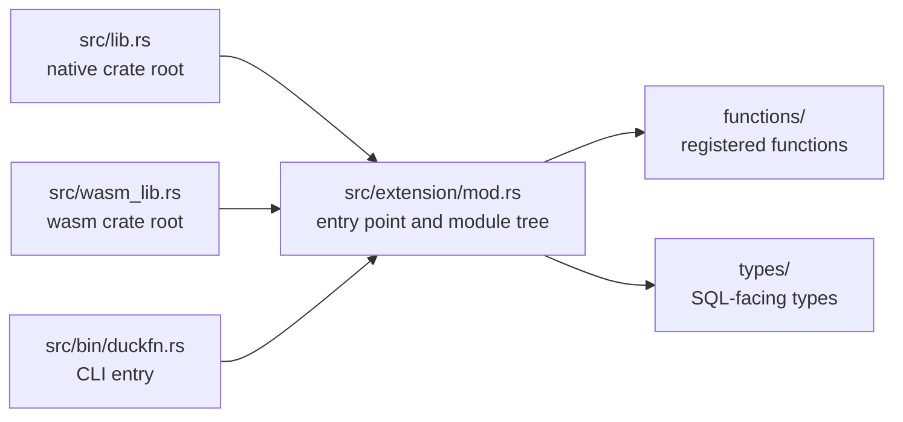

# Project structure

```text
src/lib.rs             native crate root  ->  mod extension;
src/wasm_lib.rs        wasm crate root    ->  mod extension;   (the same mods, mirrored)
src/extension/mod.rs   ->  duckfn_entrypoint!("my_extension"); + mod functions; mod types;
src/bin/duckfn.rs      duckfn CLI entry   ->  #[path] mod extension; + duckfn::cli::run(...)

src/extension/functions/
    mod.rs             mod aggregate_sum; mod scalar_greet;
    scalar_greet.rs    my_greet / my_greet_checked
    aggregate_sum.rs   my_sum
src/extension/types/
    mod.rs             an empty slot: SQL-facing types go here

src/extension/functions/…   the registered functions
test/sql/                   SQLLogicTest files
scripts/rename.sh           rename the extension after cloning
scripts/release.sh          version bump, tag, development version
Justfile                    the everyday commands
docs/                       this documentation site
community-extension/        the community-extension registration draft
```

## The two crate roots

`src/lib.rs` and `src/wasm_lib.rs` both declare exactly one module, `mod extension;`, and
`extension/mod.rs` attaches everything else. The official Rust template instead writes `mod lib;` and
forwards it a second time from the wasm root, which breaks as soon as modules nest
(`error[E0583]: file not found for module …`): there would be two copies of the same path set to keep
in sync.

Three entry points compile the same module tree — the two crate roots and the CLI:



Adding a module therefore means editing `extension/mod.rs` (and the `mod.rs` of the layer below), never
the crate roots.

## The command-line bin

`src/bin/duckfn.rs` compiles the extension a second time with `#[path = "../extension/mod.rs"] mod
extension;` and calls `duckfn::cli::run(...)`. It exists to export the function-description CSV
(`just docs_csv`) and takes no part in the extension itself.

The `#[path]` attribute is not a shortcut, it is necessary: the documentation metadata behind
`#[duck_*]` is collected by `inventory`'s static constructors, which only fire for object files that
are really linked into the final binary. With `use my_extension::…` the linker may drop those modules
and the exported CSV comes out empty — silently.

## Naming rules

| Rule | Why |
| --- | --- |
| The extension name is lowercase with underscores, and identical in five places. | It is the entry-point symbol and the artifact file name; DuckDB looks the symbol up by the file name. `just rename` writes all five. |
| Every registered SQL name carries one short prefix (`my_` here). | DuckDB has no namespaces, and community extensions almost never put the package name into function names. See the conventions in `AGENTS.md`. |
| `src/lib.rs` and `src/wasm_lib.rs` always declare the same set of `mod`s. | Otherwise the wasm build fails to compile the module tree. |
| Temporary files (scripts, data, logs) go to `target/`. | `target/` is git-ignored and never pollutes the tracked tree. |
| Text files use LF. | The repository stores LF; the `.gitattributes` normalization relies on it. |

## Where the development notes are

The repository's own `DEVELOPMENT.md` (and `DEVELOPMENT.zh.md`) carries the design notes the docs site
does not: why there are two crate roots, how the aggregate state works, which dependencies were chosen
and why. `AGENTS.md` holds the conventions, the release flow and a topic-by-topic map of duckfn's own
documentation — everything the attribute macros can do lives there, not in this repository.

Since duckfn 0.0.11 that documentation, plus a runnable example extension and its SQLLogicTest files,
ship **inside the crate package**, so they always match the version in `Cargo.toml` and need no clone of
the duckfn repository:

```shell
# after any build: the sources cargo actually compiled against
ls -d ~/.cargo/registry/src/*/duckfn-*/
```

| Path under that directory | What it is |
| --- | --- |
| `docs/docs/**` | The user guide's text (English), including the chapter per registration kind. |
| `docs/i18n/zh-Hans/…/current/**` | The same guide in Simplified Chinese. |
| `src/extension/**` | The example extension: one file per registration kind, plus custom types and a combined demo. |
| `test/sql/**` | SQLLogicTest files for the example, worth copying the structure of. |

The rendered guide is also online — [shijianjs.github.io/duckfn](https://shijianjs.github.io/duckfn/) —
but it may be newer than your dependency; the copy in the registry is what this project is compiled
against.
