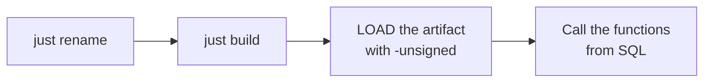

# Quick start

The whole page in four steps:



## Prerequisites

- **Rust** 1.86 or newer (`rust-version` in `Cargo.toml`).
- **[just](https://github.com/casey/just)** and **cargo-duckdb-ext-tools** — the two tools the recipes
  call:

  ```shell
  cargo install just cargo-duckdb-ext-tools
  ```

- A **DuckDB** binary 1.3 or newer (`duckdb` on `PATH`, or point at it with
  `just DUCKDB=/path/to/duckdb …`).
- Optional: **make** (inside Git Bash on Windows) and Python for the official build/test flow the CI
  uses — `just ci-build` and `just test` need them, the cargo path does not.

## 1. Rename the extension

```shell
just rename csv_stats
```

`scripts/rename.sh` rewrites the five places the extension name has to match — `Cargo.toml`
(`[package] name` and `[[example]] name`), `EXTENSION_NAME` in the Makefile, the entry-point symbol in
`src/extension/mod.rs`, the Justfile and the CI workflow — plus every occurrence in the docs, and
regenerates the `Cargo.lock` entry. It finishes by printing what still needs a human pass; the sample
functions are the main item.

## 2. Build

```shell
just build          # = cargo duckdb-ext build
```

The artifact is `target/debug/my_extension.duckdb_extension`. There is no C++ step and no local DuckDB
build: the extension is compiled against DuckDB's headers and dispatches through its API table when it
is loaded.

## 3. Load and call it

```shell
just repl           # a DuckDB REPL with the extension already loaded
```

```sql
-- or by hand; -unsigned is required for a locally built extension
duckdb -unsigned -c "LOAD './target/debug/my_extension.duckdb_extension';"
```

The sample functions, running right here — the site preloads the extension from the repository's latest
release, so no local `LOAD` is needed here (a hand-built extension still needs `-unsigned`; see the
traps below). Click **Run** on any block.

```sql {"type":"duckfn","show":"table"}
SELECT name AS input, my_greet_checked(name) AS greeting
FROM (VALUES ('world'), ('')) t(name);
```

```sql {"type":"duckfn","show":"table"}
-- my_sum skips NULLs, and a group with no value at all is NULL rather than 0.
SELECT grp, my_sum(x) AS total
FROM (VALUES ('rows', 1.5::DOUBLE), ('rows', 2.5), ('all NULL', NULL::DOUBLE)) t(grp, x)
GROUP BY grp
ORDER BY grp;
```

The failure path is a runnable block too — it declares that it is supposed to fail:

```sql {"type":"duckfn","expect":"error"}
SELECT my_greet_checked(' x ');    -- error: no surrounding whitespace
```

A single query from the command line, without a REPL:

```shell
just sql "SELECT my_greet('world')"
```

## 4. Run the tests

```shell
just test           # make configure + make debug + make test
```

The faster loop (no `make`, no Python venv of its own) is in [Testing](../guide/testing.md).

## Traps

:::warning[Three things that look like bugs and are not]

- **`-unsigned` is mandatory** when you load a locally built extension. Without it DuckDB refuses
  the file.
- **The artifact file name must stay `<extension name>.duckdb_extension`.** DuckDB finds the
  entry-point symbol through the file name, so a copy called `win.duckdb_extension` fails with
  `did not contain function "my_extension_init_c_api"`.
- **`make test` does not rebuild.** After changing Rust code run `just ci-build` (or `make debug`)
  first, otherwise the tests run against the previous artifact.

:::

One more, on Windows: if `cargo duckdb-ext build` reports the artifact is in use, a DuckDB process is
holding `target/debug/my_extension.duckdb_extension`. Build to another path instead —
`cargo duckdb-ext build -o build/debug/my_extension.duckdb_extension` — or close that process. A
`.duckdb_extension` is not a renamed DLL: DuckDB's metadata lives at the end of the file, so copying
a DLL over it produces `The metadata at the end of the file is invalid`.
