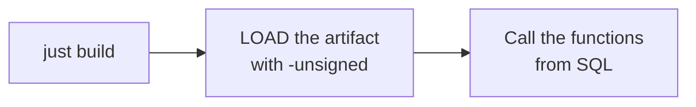

# Quick start

The whole page in three steps:



## Prerequisites

- **Rust** 1.89 or newer (`rust-version` in `Cargo.toml`; statrs pulls the floor up from the
  template's 1.86).
- **[just](https://github.com/casey/just)** — the tool the recipes call:

  ```shell
  cargo install just
  ```

- **make** (inside Git Bash on Windows) and **Python 3** — the official DuckDB
  `extension-ci-tools` build/test flow, which `just build` runs under the hood (`make configure` +
  `make debug`). `just test` uses the same flow.
- A **DuckDB** binary 1.3 or newer (`duckdb` on `PATH`, or point at it with
  `just DUCKDB=/path/to/duckdb …`).

## 1. Build

```shell
just build          # = make configure && make debug
```

The artifact is `build/debug/duckfn_statrs.duckdb_extension`. There is no C++ step and no local DuckDB
build: the extension is compiled against DuckDB's headers and dispatches through its API table when it
is loaded.

## 2. Load and call it

```shell
just repl           # a DuckDB REPL with the extension already loaded
```

```sql
-- or by hand; -unsigned is required for a locally built extension
duckdb -unsigned -c "LOAD './build/debug/duckfn_statrs.duckdb_extension';"
```

The functions, running right here — the site preloads the extension from the repository's latest
release, so no local `LOAD` is needed here (a hand-built extension still needs `-unsigned`; see the
traps below). Click **Run** on any block.

```sql {"type":"duckfn","show":"table"}
-- The summary statistics are aggregates: a column in, one value out per group.
SELECT g, sr_mean(x) AS mean, sr_std_dev(x) AS std_dev, sr_median(x) AS median
FROM (VALUES (1, 1.0), (1, 2.0), (1, 3.0), (2, 10.0), (2, 20.0), (2, NULL)) t(g, x)
GROUP BY g
ORDER BY g;
```

```sql {"type":"duckfn","show":"table"}
-- statrs cannot define the sample variance of one value: the result is NULL, not 0.
SELECT grp, sr_variance(x) AS variance
FROM (VALUES ('two', 1.5::DOUBLE), ('two', 2.5), ('one', NULL::DOUBLE), ('one', 3.0)) t(grp, x)
GROUP BY grp
ORDER BY grp;
```

```sql {"type":"duckfn","show":"table"}
-- Distribution functions are scalars, evaluated row by row.
SELECT x, sr_normal_cdf(x, 0.0, 1.0) AS cdf
FROM (VALUES (-1.96::DOUBLE), (0.0), (1.96)) t(x);
```

The failure path is a runnable block too — it declares that it is supposed to fail:

```sql {"type":"duckfn","expect":"error"}
SELECT sr_normal_pdf(0.0, 0.0, -1.0);    -- error: std_dev must be positive
```

A single query from the command line, without a REPL:

```shell
just sql "SELECT sr_mean(x) FROM range(10) t(x)"
```

## 3. Run the tests

```shell
just test           # make configure + make debug + make test
```

The faster loop (no `make`, no Python venv of its own) is in [Testing](../guide/testing.md).

## Traps

:::warning[Three things that look like bugs and are not]

- **`-unsigned` is mandatory** when you load a locally built extension. Without it DuckDB refuses
  the file.
- **The artifact file name must stay `<extension name>.duckdb_extension`.** DuckDB finds the
  entry-point symbol through the file name, so a copy called `win.duckdb_extension` fails with
  `did not contain function "duckfn_statrs_init_c_api"`.
- **`make test` does not rebuild.** After changing Rust code run `just ci-build` (or `make debug`)
  first, otherwise the tests run against the previous artifact.

:::

One more, on Windows: if `make debug` reports the artifact is in use, a DuckDB process is
holding `build/debug/duckfn_statrs.duckdb_extension` (usually a `just repl` left open) — close that
process and rebuild. A `.duckdb_extension` is not a renamed DLL: DuckDB's metadata lives at the end of
the file, so copying a DLL over it produces `The metadata at the end of the file is invalid`.
