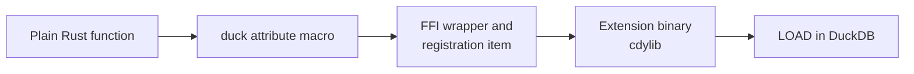

# Writing functions

A registered function is "an ordinary Rust function plus one attribute macro". The macro writes the FFI
wrapper, reads the argument columns, writes the result column, and submits the registration; the body
holds nothing but your logic.

The path from a plain function to a callable SQL function:



## What this extension registers

| Function | Kind | Signature | Behaviour |
| --- | --- | --- | --- |
| `sr_mean` and the mean / variance family | aggregate | `DOUBLE -> DOUBLE` | The state collects the column; statrs computes at finalize. |
| `sr_quantile` | aggregate | `(DOUBLE, DOUBLE) -> DOUBLE` | tau is the second, per-row-but-constant argument, kept in the state. |
| `sr_covariance` / `sr_population_covariance` | aggregate | `(DOUBLE, DOUBLE) -> DOUBLE` | Two columns paired row by row; a NULL in either skips the row. |
| `sr_normal_pdf` / `sr_normal_cdf` / `sr_normal_quantile` | scalar | `3 × DOUBLE -> DOUBLE` | Row by row; invalid parameters fail the query. |

The code lives in `src/extension/functions/`, one file per group: `aggregate_summary.rs`,
`aggregate_covariance.rs`, `scalar_normal.rs`. Statistics are aggregates on purpose —
`SELECT sr_mean(x) FROM t GROUP BY g` is the shape database users already write; a LIST + scalar form
would force a `list(x)` in front of every call.

## Scalars: three return shapes

The macro generates different code per return type:

| Signature | Meaning |
| --- | --- |
| `-> T` | A plain value, never NULL. |
| `-> DuckOptionResult<T>` | Nullable and fallible: `Ok(None)` becomes SQL `NULL`, `Err` fails the whole query. |
| `-> Option<T>` | Nullable but unable to fail. |

```rust
use duckfn::{DuckOptionResult, duck_error, duck_scalar_function};

#[duck_scalar_function(
    description = "Normal (Gaussian) quantile function: the x whose CDF equals p, for p in [0, 1]",
    comment = "A probability outside [0, 1] is a query error rather than a clamped endpoint",
    example = "SELECT sr_normal_quantile(0.975, 0.0, 1.0)"
)]
fn sr_normal_quantile(p: f64, mean: f64, std_dev: f64) -> DuckOptionResult<f64> {
    if !(0.0..=1.0).contains(&p) {
        return Err(duck_error(format!(
            "sr_normal_quantile: the probability must be within [0, 1], got {p}"
        )));
    }
    let normal = normal("sr_normal_quantile", mean, std_dev)?;
    Ok(Some(normal.inverse_cdf(p)))
}
```

### What happens to a NULL argument

Argument nullability is decided by the parameter type, and it applies to aggregates too:

- **`p: f64`** — a NULL input row is short-circuited to SQL `NULL` by duckfn's argument reader; the
  body never runs for that row. In an aggregate the row simply does not enter the state. This is what
  you want most of the time.
- **`p: Option<f64>`** — NULL reaches the body as `None` and its meaning is yours to decide (return
  NULL, substitute a default, count NULLs, …).

### Errors and panics

Return `Err(duck_error("…"))` for a value the function cannot handle; that fails the query with your
message. A `panic!` in the body is caught and reported as a DuckDB error rather than unwinding across
the FFI boundary. Error messages are user-facing: write them in English, and prefix them with the
function name so a report makes sense on its own. In this extension the line between error and NULL is
deliberate: *statrs cannot define it* → NULL (via `nan_to_null`), *the call is wrong* (std_dev ≤ 0, a
probability out of range) → error.

## Aggregates: per-row inputs plus a state

An aggregate signature is "the input columns plus one `&mut` state parameter" (in any position). The
state needs `Default + Clone + Debug` — the wrapper struct the macro generates derives them — and an
implementation of `DuckAggregateState`:

- `combine` / `simple_combine` merges two states. This is what threads and group merging go through,
  so it has to be associative.
- `result` / `simple_result` turns a state into the group's value. `simple_result` can only produce a
  never-NULL value; override `result` and return `Ok(None)` when a group has to come back as SQL NULL.
- `Output` decides the SQL return type: `i64`, `f64`, `String`, `Vec<…>` (that is, `list<…>`) and so on.

The quantile state shows the two moving parts — collected data, and the constant argument read once
per row:

```rust
#[derive(Default, Debug, Clone)]
struct QuantileState {
    values: Vec<f64>,
    tau: Option<f64>,
}

impl DuckAggregateState for QuantileState {
    type Output = f64;

    fn simple_combine(&mut self, other: &Self) {
        self.values.extend(other.values.iter().copied());
        self.tau = self.tau.or(other.tau);      // the constant is the same on every row
    }

    fn result(&self) -> DuckOptionResult<f64> {
        let Some(tau) = self.tau else {
            return Ok(None);                    // empty group -> SQL NULL
        };
        let mut data = Data::new(self.values.clone());
        super::nan_to_null(data.quantile(tau))  // statrs' NAN -> SQL NULL
    }
}

#[duck_aggregate_function(/* description / comment / example */)]
fn sr_quantile(input: f64, tau: f64, state: &mut QuantileState) {
    state.values.push(input);
    state.tau = Some(tau);
}
```

The mean / variance family shares one state and swaps only the final expression — the "what to
compute" is a type parameter, dispatched statically at compile time, not a code generator:

```rust
trait Summary {
    fn eval(values: &[f64]) -> f64;
}

#[derive(Default, Debug, Clone)]
struct SummaryState<S: Summary> {
    values: Vec<f64>,
    _marker: PhantomData<S>,
}

impl<S: Summary> DuckAggregateState for SummaryState<S> {
    type Output = f64;
    fn simple_combine(&mut self, other: &Self) {
        self.values.extend(other.values.iter().copied());
    }
    fn result(&self) -> DuckOptionResult<f64> {
        super::nan_to_null(S::eval(&self.values))
    }
}

#[duck_aggregate_function(/* ... */)]
fn sr_mean(input: f64, state: &mut SummaryState<ArithmeticMean>) {
    state.values.push(input);
}
```

Nine marker structs, one trait impl each, one-line handlers — no `macro_rules!`: generated code is
invisible to the IDE and type-unsafe, and duckfn-macro interpolates the `&mut` target as a plain
`syn::Type`, so a generic instantiation registers just as well. A state may equally hold a `String`,
a `HashMap`, a `Vec<…>`, or one slot per group key — see the aggregate chapter of the duckfn guide
for the shapes it supports.

## Adding your own

1. **Pick the attribute.** Scalar, aggregate, table function, `COPY`, cast, SQL macro or replacement
   scan: each has one, and each accepts only its own arguments. The reference is
   [the duckfn user guide](https://shijianjs.github.io/duckfn/) — the chapter for that kind.
2. **Copy the closest neighbour** from `src/extension/functions/` and change the logic, rather than
   inventing a signature from scratch. A new statrs wrapper over a column usually means a new marker
   struct, one `Summary` impl, and a one-line handler on the shared `SummaryState`.
3. **Attach it to the module tree**: add `mod my_function;` to `src/extension/functions/mod.rs`. The
   crate roots stay untouched.
4. **Write the documentation metadata** on the attribute — `description`, `comment`, `example` /
   `examples`:

   ```rust
   #[duck_scalar_function(
       description = "One line for the function table of the community-extension page",
       comment = "The detail that does not fit the one-liner",
       example = "SELECT sr_normal_pdf(0.0, 0.0, 1.0)"
   )]
   ```

   DuckDB's C extension API has no way to set a description or an example, so this text is the only
   source for the `Added Functions` table on the community-extension page. `just docs_csv` exports it
   to `target/function_descriptions.csv` (see [Community extensions](../community-extension.md)).
   Write it in English — it is pasted onto that page as it is.
5. **Cover it with a test** (see [Testing](./testing.md)) and run `just lint`. Take the expected values
   from statrs' actual output, not from a hand computation.

### Names

Every SQL name carries the short prefix `sr_`, and the part after it should read like what the function
does. A prefixed name is also what users type, so resist `duckfn_statrs_sr_mean`.

The attribute registers the **Rust function name** by default, which is why the functions are called
`sr_mean` and `sr_normal_pdf`. When one name needs several signatures (different argument types or
counts), `overloads_name = "…"` merges them into one function set instead of registering each
separately.

The macro also generates a `SQL_NAME` constant per signature. Once a name appears in several places —
error prefixes, log lines, hints — read that constant rather than repeating the literal; the price is
that such a function has to be `pub(super)`, because the generated module inherits the function's
visibility.

### Options arguments

A configuration argument (`DuckLazy<T>`) is parsed once and read inside the function, so per-row
parsing does not show up in profiles. This extension does not use one; the pattern (a named STRUCT type,
created at load time) is documented in the duckfn guide and used throughout
[duckfn_quantstats](https://github.com/shijianjs/duckfn-quantstats).
