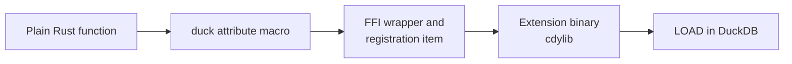

# Writing functions

A registered function is "an ordinary Rust function plus one attribute macro". The macro writes the FFI
wrapper, reads the argument columns, writes the result column, and submits the registration; the body
holds nothing but your logic.

The path from a plain function to a callable SQL function:



## The samples

| Function | Kind | Signature | Behaviour |
| --- | --- | --- | --- |
| `my_greet` | scalar | `VARCHAR -> VARCHAR` | Never NULL; the simplest possible shape. |
| `my_greet_checked` | scalar | `VARCHAR -> VARCHAR` | `NULL` for an empty name, an error for surrounding whitespace. |
| `my_sum` | aggregate | `DOUBLE -> DOUBLE` | Skips NULL inputs, `NULL` for a group with no valid row. |

All three live in `src/extension/functions/`, one file per function (or per small group of related
ones).

## Scalars: three return shapes

The macro generates different code per return type:

| Signature | Meaning |
| --- | --- |
| `-> T` | A plain value, never NULL. |
| `-> DuckOptionResult<T>` | Nullable and fallible: `Ok(None)` becomes SQL `NULL`, `Err` fails the whole query. |
| `-> Option<T>` | Nullable but unable to fail. |

```rust
use duckfn::{DuckOptionResult, duck_error, duck_scalar_function};

#[duck_scalar_function(
    description = "Greets someone by name, returning NULL for an empty name and failing on whitespace",
    comment = "The nullable-and-fallible return shape: Ok(None) is SQL NULL, Err fails the query",
    example = "SELECT my_greet_checked('')"
)]
fn my_greet_checked(name: String) -> DuckOptionResult<String> {
    if name.is_empty() {
        return Ok(None);
    }
    if name.trim() != name {
        return Err(duck_error(
            "my_greet_checked: the name must not have surrounding whitespace",
        ));
    }
    Ok(Some(format!("Hello, {name}!")))
}
```

### What happens to a NULL argument

Argument nullability is decided by the parameter type, and it applies to aggregates too:

- **`name: String`** — a NULL input row is short-circuited to SQL `NULL` by duckfn's argument reader;
  the body never runs for that row. This is what you want most of the time.
- **`name: Option<String>`** — NULL reaches the body as `None` and its meaning is yours to decide
  (return NULL, substitute a default, count NULLs, …).

### Errors and panics

Return `Err(duck_error("…"))` for a value the function cannot handle; that fails the query with your
message. A `panic!` in the body is caught and reported as a DuckDB error rather than unwinding across
the FFI boundary. Error messages are user-facing: write them in English, and prefix them with the
function name so a report makes sense on its own.

## Aggregates: per-row inputs plus a state

An aggregate signature is "the input columns plus one `&mut` state parameter" (in any position). The
state needs `Default + Clone + Debug` — the wrapper struct the macro generates derives them — and an
implementation of `DuckAggregateState`:

- `combine` / `simple_combine` merges two states. This is what threads and group merging go through,
  so it has to be associative.
- `result` / `simple_result` turns a state into the group's value. `simple_result` can only produce a
  never-NULL value; override `result` and return `Ok(None)` when a group has to come back as SQL NULL.
- `Output` decides the SQL return type: `i64`, `f64`, `String`, `Vec<…>` (that is, `list<…>`) and so on.

```rust
#[derive(Default, Debug, Clone)]
struct SumState {
    total: f64,
    rows: i64,
}

impl DuckAggregateState for SumState {
    type Output = f64;

    fn simple_combine(&mut self, other: &Self) {
        self.total += other.total;
        self.rows += other.rows;
    }

    fn result(&self) -> DuckOptionResult<f64> {
        if self.rows == 0 {
            Ok(None)          // no row at all -> SQL NULL, not 0
        } else {
            Ok(Some(self.total))
        }
    }
}
```

`SumState` counts the rows it saw so "no input at all" is told apart from "input seen, the total is
0". A state may equally hold a `String`, a `HashMap`, a `Vec<…>`, or one slot per group key — see the
aggregate chapter of the duckfn guide for the shapes it supports.

## Adding your own

1. **Pick the attribute.** Scalar, aggregate, table function, `COPY`, cast, SQL macro or replacement
   scan: each has one, and each accepts only its own arguments. The reference is
   [the duckfn user guide](https://shijianjs.github.io/duckfn/) — the chapter for that kind.
2. **Copy the closest sample** from `src/extension/functions/` and change the logic, rather than
   inventing a signature from scratch.
3. **Attach it to the module tree**: add `mod my_function;` to `src/extension/functions/mod.rs`. The
   crate roots stay untouched.
4. **Write the documentation metadata** on the attribute — `description`, `comment`, `example` /
   `examples`:

   ```rust
   #[duck_scalar_function(
       description = "One line for the function table of the community-extension page",
       comment = "The detail that does not fit the one-liner",
       example = "SELECT my_greet('world')"
   )]
   ```

   DuckDB's C extension API has no way to set a description or an example, so this text is the only
   source for the `Added Functions` table on the community-extension page. `just docs_csv` exports it
   to `target/function_descriptions.csv` (see [Community extensions](../community-extension.md)).
   Write it in English — it is pasted onto that page as it is.
5. **Cover it with a test** (see [Testing](./testing.md)) and run `just lint`.

### Names

Every SQL name carries one short prefix (`my_` in this template), and the part after it should read
like what the function does. A prefixed name is also what users type, so resist `my_ext_my_thing`.

The attribute registers the **Rust function name** by default, which is why the samples are called
`my_greet` and `my_sum`. When one name needs several signatures (different argument types or counts),
`overloads_name = "…"` merges them into one function set instead of registering each separately.

The macro also generates a `SQL_NAME` constant per signature. Once a name appears in several places —
error prefixes, log lines, hints — read that constant rather than repeating the literal; the price is
that such a function has to be `pub(super)`, because the generated module inherits the function's
visibility.

### Options arguments

A configuration argument (`DuckLazy<T>`) is parsed once and read inside the function, so per-row
parsing does not show up in profiles. The template does not use one; the pattern (a named STRUCT type,
created at load time) is documented in the duckfn guide and used throughout
[duckfn_quantstats](https://github.com/shijianjs/duckfn-quantstats).
