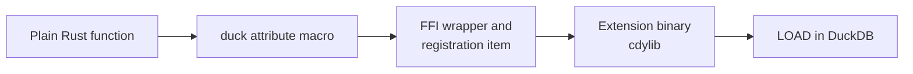

# Writing functions

A registered function is "an ordinary Rust function plus one attribute macro". The macro writes the FFI
wrapper, reads the argument columns, writes the result column, and submits the registration; the body
holds nothing but your logic.

The path from a plain function to a callable SQL function:



## What this extension registers

| Family | Kind | Shape | Notes |
| --- | --- | --- | --- |
| Statistics (`statistics/`) | aggregate | one/two DOUBLE columns -> DOUBLE | means, order statistics (median / quantile / percentile / ranks), variance families, covariance; `auto_collect`, NULL rows skipped, undefined statistics -> NULL. |
| Continuous distributions (`distribution/`) | scalar | DOUBLE in -> DOUBLE out | 20 distributions × `sr_<dist>_pdf / ln_pdf / cdf / sf / quantile`; invalid parameters fail the query. |
| Discrete distributions (`distribution/`) | scalar | DOUBLE in -> DOUBLE out | 7 distributions × `pmf / ln_pmf / cdf / sf / quantile`; integer slots take whole-number DOUBLE literals (validated, never rounded). |
| Special functions (`function.rs`) | scalar | DOUBLE in -> DOUBLE out | erf / gamma / beta families, factorials and binomial coefficients, harmonic numbers, logistic and logit. |
| Constants (`consts.rs`) | scalar | () -> DOUBLE | statrs::consts as zero-argument functions. |

The code lives in `src/extension/functions/`, its tree mirroring statrs' modules
(`consts.rs`, `function.rs`, `statistics/`, `distribution/`); the correspondence table and the list of
deliberate exclusions sit in the `mod.rs` headers. Statistics are aggregates on purpose —
`SELECT sr_mean(x) FROM t GROUP BY g` is the shape database users already write; a LIST + scalar form
would force a `list(x)` in front of every call.

## Scalars: three return shapes

The macro generates different code per return type:

| Signature | Meaning |
| --- | --- |
| `-> T` | A plain value, never NULL. |
| `-> DuckOptionResult<T>` | Nullable and fallible: `Ok(None)` becomes SQL `NULL`, `Err` fails the whole query. |
| `-> Option<T>` | Nullable but unable to fail. |

```rust
use duckfn::{DuckOptionResult, duck_error, duck_scalar_function};

#[duck_scalar_function(
    description = "Normal (Gaussian) quantile function: the x whose CDF equals p, for p in [0, 1]",
    comment = "A probability outside [0, 1] is a query error rather than a clamped endpoint",
    example = "SELECT sr_normal_quantile(0.975, 0.0, 1.0)"
)]
fn sr_normal_quantile(p: f64, mean: f64, std_dev: f64) -> DuckOptionResult<f64> {
    if !(0.0..=1.0).contains(&p) {
        return Err(duck_error(format!(
            "sr_normal_quantile: the probability must be within [0, 1], got {p}"
        )));
    }
    let normal = normal("sr_normal_quantile", mean, std_dev)?;
    Ok(Some(normal.inverse_cdf(p)))
}
```

### What happens to a NULL argument

Argument nullability is decided by the parameter type, and it applies to aggregates too:

- **`p: f64`** — a NULL input row is short-circuited to SQL `NULL` by duckfn's argument reader; the
  body never runs for that row. In an aggregate the row simply does not enter the state. This is what
  you want most of the time.
- **`p: Option<f64>`** — NULL reaches the body as `None` and its meaning is yours to decide (return
  NULL, substitute a default, count NULLs, …).

### Errors and panics

Return `Err(duck_error("…"))` for a value the function cannot handle; that fails the query with your
message. A `panic!` in the body is caught and reported as a DuckDB error rather than unwinding across
the FFI boundary. Error messages are user-facing: write them in English, and prefix them with the
function name so a report makes sense on its own. In this extension the line between error and NULL is
deliberate: *statrs cannot define it* → NULL (via `nan_to_null`), *the call is wrong* (std_dev ≤ 0, a
probability out of range) → error.

## Aggregates: collect with `auto_collect`

The underlying machinery (from the duckfn aggregate guide): an aggregate is "per-row inputs plus
a `&mut` state" (the state may sit anywhere), the state needs `Default + Clone + Debug` and an
implementation of `DuckAggregateState`:

- `combine` / `simple_combine` merges two states. This is what threads and group merging go through,
  so it has to be associative.
- `result` / `simple_result` turns a state into the group's value. `simple_result` can only produce a
  never-NULL value; override `result` and return `Ok(None)` when a group has to come back as SQL NULL.
- `Output` decides the SQL return type: `i64`, `f64`, `String`, `Vec<…>` (that is, `list<…>`) and so on.

This extension never writes any of that by hand. "Collect the columns, compute once at finalize" is
the shape of every statistic here, and that is exactly what
`#[duck_aggregate_function(auto_collect = true)]` (duckfn 0.0.18+) generates: the annotated function
*is* the finalize handler — a `Vec<T>` parameter is a column collected across rows, a `DuckFirst<T>`
parameter is a per-query constant resolved once, and the return value follows the scalar rules
(`-> T`, `-> Option<T>`, `-> DuckOptionResult<T>`). The macro builds the state, the merging
`simple_combine` and the NULL-valued `result` underneath:

```rust
#[duck_aggregate_function(
    auto_collect = true,
    description = "Tau quantile of a DOUBLE column, tau as the second (constant) argument, NULL when empty or tau is not in [0, 1]",
    example = "SELECT sr_quantile(x, 0.5) FROM (VALUES (1.0), (2.0), (3.0), (4.0)) t(x)"
)]
fn sr_quantile(values: Vec<f64>, tau: DuckFirst<f64>) -> DuckOptionResult<f64> {
    let mut data = Data::new(values);
    super::nan_to_null(data.quantile(tau))   // statrs' NAN -> SQL NULL
}
```

The NULL rules come from the same machinery: a NULL in any non-`Option` column drops the whole row
from the collection — which is what keeps `sr_covariance`'s two `Vec<f64>` parameters paired without
any length check — and an empty group with a non-nullable `DuckFirst<T>` has no value to resolve, so
`auto_collect` reports NULL for that group instead of calling the function. Parallel `combine`,
structured outputs and `overloads_name` all keep working; when a genuinely custom state shape is
needed, the hand-written form above is still the fallback (see the aggregate chapter of the duckfn
guide).

## Adding your own

1. **Pick the attribute.** Scalar, aggregate, table function, `COPY`, cast, SQL macro or replacement
   scan: each has one, and each accepts only its own arguments. The reference is
   [the duckfn user guide](https://shijianjs.github.io/duckfn/) — the chapter for that kind.
2. **Copy the closest neighbour** from `src/extension/functions/` and change the logic, rather than
   inventing a signature from scratch. A new statrs wrapper over a column is usually just a new
   `auto_collect = true` aggregate taking the column as `Vec<f64>` (columns to pair: a second
   `Vec<f64>`) and delegating to statrs once.
3. **Attach it to the module tree**: add `mod my_function;` to `src/extension/functions/mod.rs`. The
   crate roots stay untouched.
4. **Write the documentation metadata** on the attribute — `description`, `comment`, `example` /
   `examples`:

   ```rust
   #[duck_scalar_function(
       description = "One line for the function table of the community-extension page",
       comment = "The detail that does not fit the one-liner",
       example = "SELECT sr_normal_pdf(0.0, 0.0, 1.0)"
   )]
   ```

   DuckDB's C extension API has no way to set a description or an example, so this text is the only
   source for the `Added Functions` table on the community-extension page. `just docs_csv` exports it
   to `target/function_descriptions.csv` (see [Community extensions](../community-extension.md)).
   Write it in English — it is pasted onto that page as it is.
5. **Cover it with a test** (see [Testing](./testing.md)) and run `just lint`. Take the expected values
   from statrs' actual output, not from a hand computation.

### Names

Every SQL name carries the short prefix `sr_`, and the part after it should read like what the function
does. A prefixed name is also what users type, so resist `duckfn_statrs_sr_mean`.

The attribute registers the **Rust function name** by default, which is why the functions are called
`sr_mean` and `sr_normal_pdf`. When one name needs several signatures (different argument types or
counts), `overloads_name = "…"` merges them into one function set instead of registering each
separately.

The macro also generates a `SQL_NAME` constant per signature. Once a name appears in several places —
error prefixes, log lines, hints — read that constant rather than repeating the literal; the price is
that such a function has to be `pub(super)`, because the generated module inherits the function's
visibility.

### Options arguments

A configuration argument (`DuckLazy<T>`) is parsed once and read inside the function, so per-row
parsing does not show up in profiles. This extension does not use one; the pattern (a named STRUCT type,
created at load time) is documented in the duckfn guide and used throughout
[duckfn_quantstats](https://github.com/shijianjs/duckfn-quantstats).
