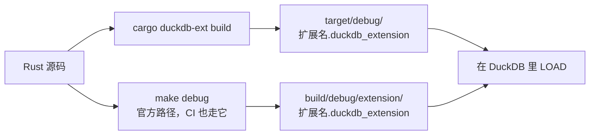

# 构建与发版

## 两条构建路径

两条都保留着，按手头的事选快的那条。

```shell
cargo duckdb-ext build   # 日常迭代，不需要 make
# -> target/debug/my_extension.duckdb_extension

make configure           # 只做一次：建 configure/venv（Python 与 sqllogictest 运行器）
make debug               # 官方模板那条路，CI 也走它
# -> build/debug/extension/my_extension/my_extension.duckdb_extension
```

两条路径，以及各自把产物放在哪：



`make release` 是带优化的同一套流程。Windows 上 `make` 需要在 Git Bash 里跑。

## Justfile

| 命令 | 做什么 |
| --- | --- |
| `just build` | `cargo duckdb-ext build` |
| `just sql "SELECT my_greet('world')"` | 先构建，再跑一条语句就退出 |
| `just repl` | 已 LOAD 扩展的 DuckDB REPL |
| `just lint` | `cargo clippy --all-targets -- -D warnings` |
| `just test` | 官方构建 + sqllogictest |
| `just docs_csv` | 把函数描述导出到 `target/function_descriptions.csv` |
| `just docs_build` / `just docs_start` | 构建 / 本地预览这份文档站 |
| `just rename <名字>` | 一次改齐扩展名 |
| `just release_*` | 下面那套发版流程 |
| `just sync-common` / `just check-common` | 更新 / 比对 `scripts/common.just`（见下） |

上面这些 recipe 都在 `scripts/common.just` 里 —— 那是所有扩展项目共享的一份文件，由根 `Justfile`
`import` 进来（`just --list` 看到的是合并后的全集）。它的源在 duckfn 仓库：`just sync-common` 拉回
最新副本，`just check-common` 在副本不一致时报错。本项目特有的命令写进根 `Justfile`，不要去改副本；
细节见 `AGENTS.md`。

## 发版流程

一次发版四步，只有第二步需要人来做：

| 步骤 | 命令 |
| --- | --- |
| 0. 前置检查 | `just release_check`（clippy + 构建）；改动大时再 `just test` |
| 1. 提升版本号 | `just release_bump {{EXTENSION_VERSION}}` |
| 2. 提交并打 tag | `git commit …` 后 `just release_tag {{EXTENSION_VERSION}}` |
| 3. 看 CI | `just release_ci`，再 `gh run watch <run-id>` |
| 4. 切下一开发版本 | `just release_dev 0.1.1-dev.0` |

版本号只写在 `Cargo.toml` 的 `[package] version` 里，别处不写：`scripts/release.sh bump` 会改这一行、
更新文档与 CI 注释里的出现处、同步 `Cargo.lock`，并改写 `docs/extension-version.ts`（文档站显示的版本号
就是从那里来的）。tag 必须与 `Cargo.toml` 一致 —— cargo 会把版本号写进构建出的扩展二进制，对不上就会发出
一个自称别的版本的 Release。

只有正式版本才打 tag。`0.1.1-dev.0` 这类版本留在分支上：不打 tag、不发布、也不部署站点。

### 推一个 tag 会触发什么

推送 `v*.*.*` 会启动 **Main Extension Distribution Pipeline**：


- **Main Extension Distribution Pipeline** —— 为所有支持的平台构建扩展、跑测试，然后为该 tag 创建
  （或更新）GitHub Release，把产物按 `<扩展名>-<架构>.duckdb_extension` 挂上去（wasm 那份是
  `.duckdb_extension.wasm`）。release notes 是上一个版本 tag 到当前 tag 之间的提交。
- **Deploy Docs** 不是由 tag 启动的，而是由那条流水线**跑完**触发：它构建 `docs/` 并发布到 GitHub
  Pages（会等 Release 就绪，部署出去的站点预加载的正是它）。需要先在 Settings → Pages → Source 里选
  *GitHub Actions*，一次性设置。

PR 只构建 + 测试，不发布：发布那一步由「当前 ref 是版本 tag」这个条件把着。

### 安装一份发布产物

```sql
LOAD 'https://github.com/<owner>/<repo>/releases/latest/download/my_extension-windows_amd64.duckdb_extension';
```

本地构建的产物要 `duckdb -unsigned`；从 Release 下载的产物同样要加这个参数，因为它没有 DuckDB 分发密钥
的签名。这正是[社区扩展](./community-extension.md)那条路解决的问题：注册之后 `INSTALL … FROM community`
会按用户平台取回一份签过名、版本严格匹配的产物。

## WebAssembly

```shell
just config_env   # 只做一次：固定工具链版本并装 wasm32-unknown-emscripten target
just build_wasm
```

wasm 构建走 `src/wasm_lib.rs`（`src/lib.rs` 的 `staticlib` 镜像）。两个 crate root 必须始终声明同一组
`mod`；平台相关的依赖请挂到 `Cargo.toml` 的 `[target.'cfg(…'.dependencies]` 下，别让 wasm 目标替它们付
编译成本（有些 crate 在 emscripten 上根本编不过）。

在 `wasm32-unknown-emscripten` 下，`cdylib` 必须按 **side module** 链接：cargo 会把依赖 duckfn 的
`cdylib` 也编一遍，少了 `-sSIDE_MODULE=2` 时 emcc 会按独立模块链接、报 `undefined symbol: main`。
这个 flag 写在 `.cargo/config.toml` 的 `[target.wasm32-unknown-emscripten] rustflags` 里 —— 别删，
`just build_wasm` / `just build_wasm_eh` 靠它。
