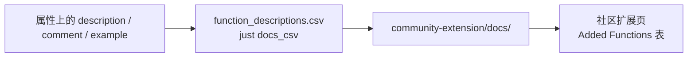

# 社区扩展

把扩展注册进 [duckdb/community-extensions](https://github.com/duckdb/community-extensions)，才能把
「从 GitHub Release 下载一个文件」变成：

```sql
INSTALL my_extension FROM community;   -- 只需一次，需要网络
LOAD my_extension;
```

社区仓构建出的产物是签过名的、并与用户的 DuckDB 版本严格匹配，所以不再需要 `-unsigned`。注册本身是一个
只加**两份文件**的 PR：

| 本仓库 | 社区仓里的位置 |
| --- | --- |
| `community-extension/description.yml` | `extensions/my_extension/description.yml` |
| `community-extension/docs/function_descriptions.csv` | `extensions/my_extension/docs/function_descriptions.csv` |

目录名必须与 `extension.name` 逐字一致 —— 社区仓的 `scripts/build.py` 会校验这一点。

## 那份 CSV

社区扩展页 `Added Functions` 表里的 description / comment / example 只有一个来源：这份 CSV
（DuckDB 的 C 扩展 API 没有设置它们的接口）。文案来自 `#[duck_*]` 属性上的 `description` / `comment` /
`example`，也就是说它紧挨着被描述的函数：

```rust
#[duck_scalar_function(
    description = "Greets someone by name, the simplest possible scalar function",
    comment = "…",
    example = "SELECT my_greet('world')"
)]
```

改了这些属性就重新生成、覆盖过去：

```shell
just docs_csv
cp target/function_descriptions.csv community-extension/docs/function_descriptions.csv
```

从属性到页面：



多条示例导出时用 `"; "` 拼接、每条去掉结尾分号；换行会压成一个空格（生成页是 Markdown 表格）。所以一句
一条完整 SQL，用英文写即可。

## `description.yml`

这个文件会被原样复制到社区仓，所以里面只有字段、没有注释。需要你决定的字段：

| 字段 | 填什么 |
| --- | --- |
| `extension.name` | 扩展名，与目录名、入口点符号逐字一致。 |
| `extension.description` | 一行说明，显示在扩展列表里。 |
| `extension.version` | 要发布的那一版，不要 `-dev.N` 后缀。 |
| `extension.language` / `build` | 从本模板起步的项目就是 `Rust` 与 `cargo`。 |
| `extension.license` | `MIT`（对应仓库根目录的 `LICENSE`）。注意社区**文档页**把它写成 `licence`，真实 schema 是 `license`。 |
| `extension.requires_toolchains` | `"rust;python3"` —— 与 CI 工作流的 `extra_toolchains` 一致。 |
| `extension.maintainers` | 你的 GitHub 账号。 |
| `repo.github` | `owner/repository`。 |
| `repo.ref` | 发布那一版的**提交 SHA**（40 位）—— `git rev-list -n 1 v0.1.0` —— 不要写 `main`，也不要写 tag 名。注册项指向的应当是不可变的代码，而从分支构建出的产物会自称开发版本。 |
| `docs.hello_world` | 可直接复制跑的示例，会渲染进代码块。不要在这里写 `INSTALL` / `LOAD`：页面自己会加。 |
| `docs.extended_description` | 函数表周围的正文。 |

每个字段的来历与提交步骤，`community-extension/AGENTS.md` 里讲得更细。

## 提交

```shell
# 1. 在 duckdb/community-extensions 的 fork 克隆里
git checkout -b add-my-extension

# 2. 把两份文件复制到位
mkdir -p extensions/my_extension/docs
cp <本仓库>/community-extension/description.yml extensions/my_extension/
cp <本仓库>/community-extension/docs/function_descriptions.csv extensions/my_extension/docs/

# 3. 提交、推分支、开 PR
git add extensions/my_extension
git commit -m "Add my_extension: …"
gh pr create --repo duckdb/community-extensions --base main --head <你>:add-my-extension
```

维护者会点起来那几条构建工作流（首次贡献者的 PR 会先挂在 `action_required`，等有人批准后才跑，属正常
状态）。合并之后 `INSTALL my_extension FROM community` 就真的可用了，README 也可以改成那种加载方式。

## 每次发版都要回来改

`repo.ref` 与 `extension.version` 钉的是某一版。每次发版之后，在本仓库的 `community-extension/` 里改这两
处，复制进社区仓那份克隆，推到同一条 PR 分支（PR 会自动更新）或另开一个。`just release_bump` 已经会顺带
改写 `version` 字段；提交 SHA 那一处仍然要人工填。
