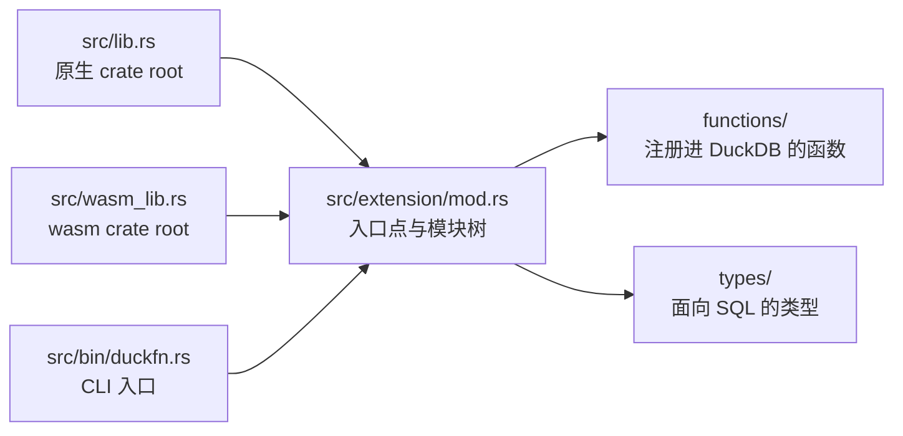

# 目录结构

```text
src/lib.rs             原生 crate root  ->  mod extension;
src/wasm_lib.rs        wasm crate root  ->  mod extension;   （同一组 mod，镜像）
src/extension/mod.rs   ->  duckfn_entrypoint!("my_extension"); + mod functions; mod types;
src/bin/duckfn.rs      duckfn CLI 入口  ->  #[path] mod extension; + duckfn::cli::run(...)

src/extension/functions/
    mod.rs             mod aggregate_sum; mod scalar_greet;
    scalar_greet.rs    my_greet / my_greet_checked
    aggregate_sum.rs   my_sum
src/extension/types/
    mod.rs             空的槽：面向 SQL 的类型放这一层

test/sql/                   SQLLogicTest 用例
scripts/rename.sh           克隆后改扩展名
scripts/release.sh          提版本号、打 tag、切开发版本
Justfile                    日常命令
docs/                       这份文档站
community-extension/        社区扩展注册草稿
```

## 两个 crate root

`src/lib.rs` 与 `src/wasm_lib.rs` 都只声明一个模块 `mod extension;`，其余子模块由 `extension/mod.rs`
往下挂。官方 Rust 模板的写法是 `mod lib;` 再由 wasm 那个 root 转发一次，模块一嵌套就会
`error[E0583]: file not found for module …`：那等于同一组路径存了两份、要一直保持同步。

三个入口都编同一棵模块树 —— 两个 crate root 与那个 CLI：



所以新增模块只需要动 `extension/mod.rs`（以及下一层的 `mod.rs`），永远不用改 crate root。

## 命令行工具

`src/bin/duckfn.rs` 用 `#[path = "../extension/mod.rs"] mod extension;` 把扩展再编一遍，然后调用
`duckfn::cli::run(...)`。它存在的意义是导出函数描述 CSV（`just docs_csv`），不参与扩展本体。

那里的 `#[path]` 不是省事的写法，而是必需的：`#[duck_*]` 的文档元数据靠 `inventory` 的静态构造器收集，
只有**真正被链接进最终二进制**的目标文件才会生效。写成 `use my_extension::…` 时，链接器可能把这些模块
整块丢掉，导出的 CSV 就会静默变空。

## 命名规则

| 规则 | 为什么 |
| --- | --- |
| 扩展名全小写、只含下划线，且五处一致。 | 它既是入口点符号，也是产物文件名；DuckDB 是按文件名去找符号的。`just rename` 负责写全这五处。 |
| 每个注册进 SQL 的名字共用一个短前缀（模板里是 `my_`）。 | DuckDB 没有命名空间，而社区扩展几乎都不把包名写进函数名。约定见 `AGENTS.md`。 |
| `src/lib.rs` 与 `src/wasm_lib.rs` 始终声明同一组 `mod`。 | 否则 wasm 构建编不出这棵模块树。 |
| 临时文件（脚本、数据、日志）放 `target/`。 | `target/` 已被 git 忽略，不会污染被跟踪的目录。 |
| 文本文件一律 LF。 | 仓库按 LF 入库，`.gitattributes` 的归一化依赖这一点。 |

## 开发笔记在哪

仓库自己的 `DEVELOPMENT.zh.md`（英文版 `DEVELOPMENT.md`）收着文档站不写的设计说明：为什么是两个
crate root、聚合状态怎么工作、每个依赖为什么被选进来。`AGENTS.md` 里是约定、发版流程，以及一份
「duckfn 自己的文档按主题在哪儿」的对照表 —— 属性宏能做的所有事都在那边，不在本仓库里。

duckfn 0.0.11 起，那份指南连同**可运行的示例扩展**与它的 SQLLogicTest 用例都随 crate 一起发布，
所以它们始终与 `Cargo.toml` 里的版本一致，也不需要 clone duckfn 的 git 仓库：

```shell
# 跑过一次构建之后：cargo 实际编译的那份源码
ls -d ~/.cargo/registry/src/*/duckfn-*/
```

| 那个目录下的路径 | 是什么 |
| --- | --- |
| `docs/docs/**` | 用户指南正文（英文），含每类注册方式各一章。 |
| `docs/i18n/zh-Hans/…/current/**` | 同一份指南的简体中文版。 |
| `src/extension/**` | 示例扩展：每类注册方式一个文件，外加自定义类型与一个组合示例。 |
| `test/sql/**` | 示例的 SQLLogicTest 用例，抄结构用。 |

指南也有渲染好的在线版本 [shijianjs.github.io/duckfn/zh-Hans](https://shijianjs.github.io/duckfn/zh-Hans/)，
但它可能比你的依赖新；registry 里那份才是本项目实际编译的代码。
