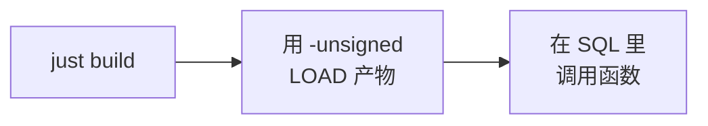

# 快速开始

整页就是三步：



## 前置条件

- **Rust** 1.89 或更新（`Cargo.toml` 里的 `rust-version`；statrs 把模板的 1.86 下限抬了上去）。
- **[just](https://github.com/casey/just)** 与 **cargo-duckdb-ext-tools** —— recipe 会调用它们：

  ```shell
  cargo install just cargo-duckdb-ext-tools
  ```

- 一个 **DuckDB** 1.3 或更新的可执行文件（`duckdb` 在 `PATH` 里，或者用
  `just DUCKDB=/path/to/duckdb …` 指定）。
- 可选：**make**（Windows 上要在 Git Bash 里跑）与 Python —— CI 用的那套官方构建 / 测试流程需要它们，
  cargo 那条路不需要。

## 1. 构建

```shell
just build          # = cargo duckdb-ext build
```

产物是 `target/debug/duckfn_statrs.duckdb_extension`。没有 C++ 这一步，也不需要本地编译 DuckDB：扩展
只用到 DuckDB 的头文件，加载时通过它的 API 表分发。

## 2. 加载并调用

```shell
just repl           # 已经 LOAD 好扩展的 DuckDB REPL
```

```sql
-- 或者手动来；本地构建的产物必须加 -unsigned
duckdb -unsigned -c "LOAD './target/debug/duckfn_statrs.duckdb_extension';"
```

下面这些函数就地就能跑 —— 站点从仓库的最新 Release 预加载了这个扩展，这里不用写 `LOAD`
（本地自己构建的产物仍然要加 `-unsigned`，见下面的几个坑）。点任意块上的 **执行** 即可。

```sql {"type":"duckfn","show":"table"}
-- 统计量是聚合函数：一列进，每个分组一个值出。
SELECT g, sr_mean(x) AS mean, sr_std_dev(x) AS std_dev, sr_median(x) AS median
FROM (VALUES (1, 1.0), (1, 2.0), (1, 3.0), (2, 10.0), (2, 20.0), (2, NULL)) t(g, x)
GROUP BY g
ORDER BY g;
```

```sql {"type":"duckfn","show":"table"}
-- statrs 算不出单值的样本方差：结果是 NULL 而不是 0。
SELECT grp, sr_variance(x) AS variance
FROM (VALUES ('two', 1.5::DOUBLE), ('two', 2.5), ('one', NULL::DOUBLE), ('one', 3.0)) t(grp, x)
GROUP BY grp
ORDER BY grp;
```

```sql {"type":"duckfn","show":"table"}
-- 分布函数是标量，逐行求值。
SELECT x, sr_normal_cdf(x, 0.0, 1.0) AS cdf
FROM (VALUES (-1.96::DOUBLE), (0.0), (1.96)) t(x);
```

失败路径同样是个可运行块 —— 它自己声明了「应该失败」：

```sql {"type":"duckfn","expect":"error"}
SELECT sr_normal_pdf(0.0, 0.0, -1.0);    -- 报错：std_dev 必须为正
```

不进 REPL、只跑一条语句：

```shell
just sql "SELECT sr_mean(x) FROM range(10) t(x)"
```

## 3. 跑测试

```shell
just test           # make configure + make debug + make test
```

更快的迭代方式（不需要 `make`、也不用手动建 Python venv）见[测试](../guide/testing.md)。

## 几个坑

:::warning[三个看着像 bug、其实不是的]

- **本地构建的产物加载时必须加 `-unsigned`**，不加 DuckDB 会直接拒绝这个文件。
- **产物文件名必须保持 `<扩展名>.duckdb_extension`。** DuckDB 是按文件名去找入口点符号的，复制成
  `win.duckdb_extension` 会报 `did not contain function "duckfn_statrs_init_c_api"`。
- **`make test` 不会自动重新构建。** 改完 Rust 先跑 `just ci-build`（或 `make debug`），否则测试跑的
  还是上一次的产物。

:::

Windows 上还有一条：如果 `cargo duckdb-ext build` 报产物被占用，说明有 DuckDB 进程正拿着
`target/debug/duckfn_statrs.duckdb_extension`。换个路径构建
（`cargo duckdb-ext build -o build/debug/duckfn_statrs.duckdb_extension`）或者关掉那个进程即可。
`.duckdb_extension` 不是改了名的 DLL：DuckDB 的元数据在文件尾，直接 `Copy-Item` 一个 DLL 过去会报
`The metadata at the end of the file is invalid`。
