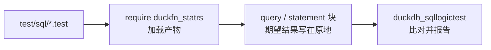

# 测试

测试用 [SQLLogicTest](https://duckdb.org/dev/sqllogictest/intro) 格式写在 `test/sql/` 下，与 DuckDB
自己的测试套件同一种格式。一个文件就是一串 `query` / `statement` 块，期望结果写在原地，所以用例同时也是
函数行为的可运行示例。

| 文件 | 覆盖什么 |
| --- | --- |
| `duckfn_statrs.test` | 冒烟：LOAD 之前函数不存在、`require` 之后注册的函数都在；另加一份 `duckdb_functions()` 的盘点（`sr_` 前缀下 12 个聚合 + 3 个标量）。 |
| `aggregate_summary.test` | 统计量聚合：期望值取自 statrs 实际输出、NULL 行跳过、空组 → `NULL`、算不出的统计量（单值的样本方差、越界 tau、几何/调和平均里的负数）→ `NULL`、`GROUP BY`、`PRAGMA threads=4` 下的 `combine`、跨 DataChunk、binder 报错。 |
| `aggregate_covariance.test` | 两列聚合：按行配对、任一列 NULL 整行跳过、只有一对时样本 vs 总体（NULL vs 0）、空组、参数个数报错。 |
| `scalar_normal.test` | 分布标量：锚点值、分位数/CDF 往返回路、NULL 参数短路、非法 `std_dev` 与越界概率的查询报错、参数来自列、跨 DataChunk。 |

## 怎么跑

一个文件是怎么走到运行器的：



```shell
just test                 # = make configure + make debug + make test
just ci-build             # 只做官方构建，不跑测试
```

`just test` 走 DuckDB 官方的 Makefile 流程，CI 也是这条。两件要知道的事：

- **它不会自动重新构建。** 改完 Rust 先跑 `just ci-build`（或 `make debug`），否则测试跑的是上一次的
  产物。
- **Windows 上 `make` 必须在 Git Bash 里跑**，PowerShell 里跑不起来。

### 更快的迭代

DuckDB 的测试运行器可以直接驱动产物，完全跳过 `make`。它需要一个装了 `duckdb_sqllogictest` 的 Python
环境 —— `make configure` 会在 `configure/venv` 下建一个，你也可以用任何装了这个包的 Python 3 环境：

```bash
# Linux / macOS
./configure/venv/bin/python -m duckdb_sqllogictest \
    --test-dir test/sql \
    --external-extension build/debug/duckfn_statrs.duckdb_extension
```

```powershell
# Windows
.\configure\venv\Scripts\python.exe -m duckdb_sqllogictest `
    --test-dir test/sql `
    --external-extension build/debug/duckfn_statrs.duckdb_extension
```

`--test-dir` 必给：它同时是 `__TEST_DIR__` 的取值，也就是会落盘写文件的用例拿到的目录。只跑一份就再加
`--file-path test/sql/aggregate_summary.test`。

## 约定

- **每个文件都从干净的数据库开始**，所以 `duckfn_statrs.test` 可以断言加载前函数不存在，其余文件开头写
  `require duckfn_statrs`。
- **错误是子串匹配。** `statement error` 下面写有辨识度的那一段就够了，不必抄 DuckDB 整条错误消息 ——
  抄全了反而会把用例绑死在一个随时可能改的文案上。
- **留意值怎么打印。** `DOUBLE` 打印成 `7.0`；用例关心的是数字而不是类型时，转一下
  （`sr_mean(x)::DECIMAL(12,6)`），这样类型变了期望值也不用改 —— 期望的数字取自 statrs 的实际输出，
    不要手算。
- **按关注点拆文件**，不要按函数个数：行为一份、错误路径一份；用到社区扩展（比如解析 HTML）的用例单独
  放，因为它首次运行需要网络。

## 新增函数至少覆盖什么

正常值、`NULL`、边界值、错误路径。另外三条很值：

- 文件是冒烟测试的话，加一条 `LOAD` 之前的 `statement error` … `does not exist`；
- 一条 **不是常量折叠** 的 NULL 输入 —— 常量 `NULL` 根本不会进函数体；
- 行数超过 `STANDARD_VECTOR_SIZE`（2048）的用例 —— 聚合的 `combine`、标量的逐 chunk 路径都靠它才跑到。

提交前：`just lint`（`cargo clippy --all-targets -- -D warnings`）。
